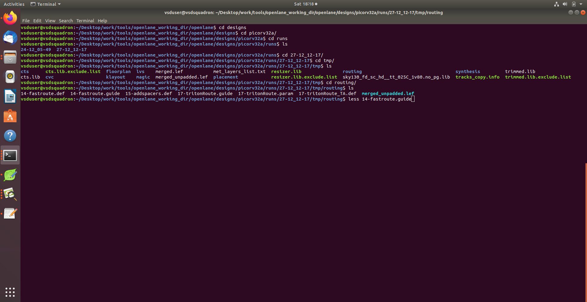
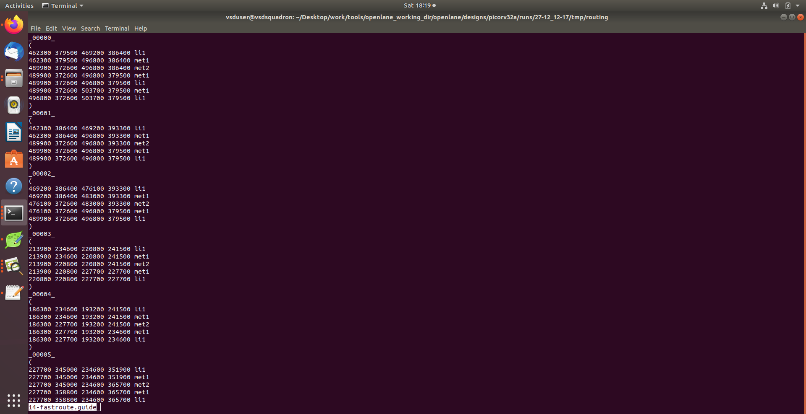
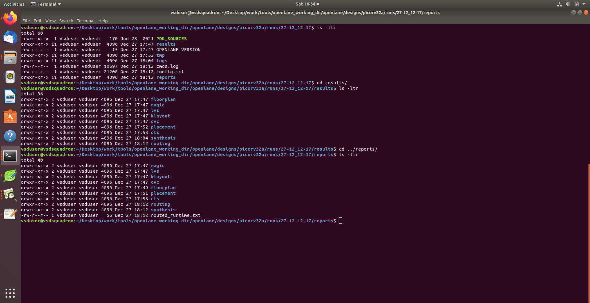
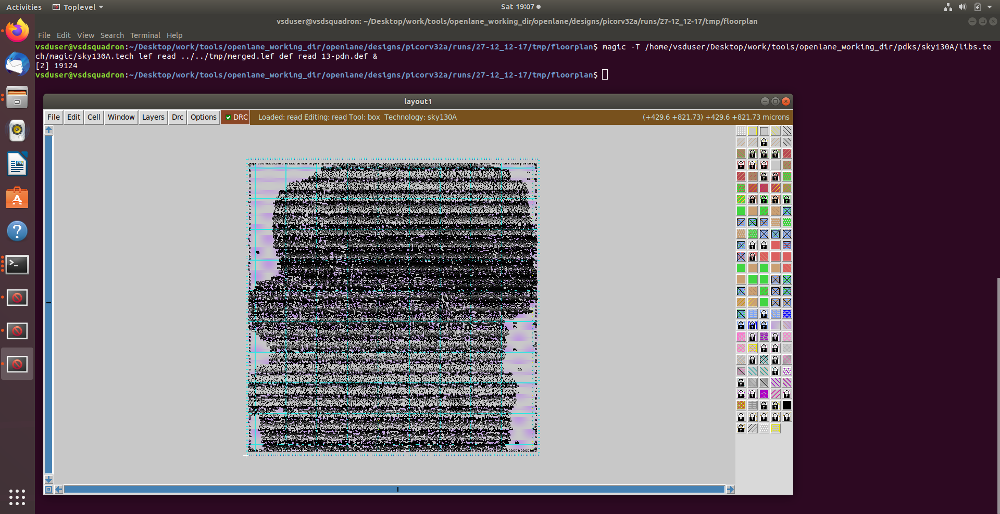
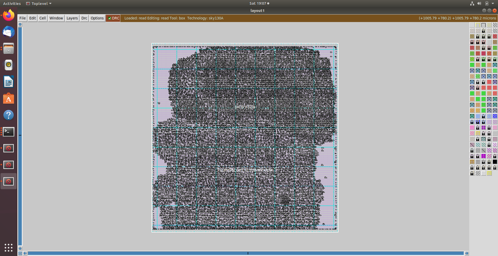
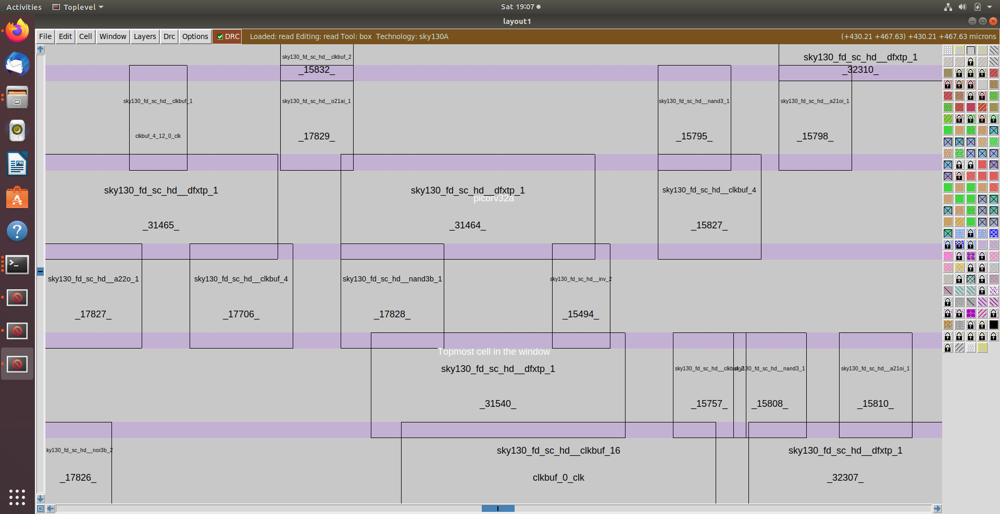

# Parasitic Extraction & GDSII Generation
> PicoRV32a — OpenLANE Physical Design Flow

<h2>🔍 Overview</h2>

- Performed post-route parasitic extraction using **SPEF Extractor** — RC wire data generated for all nets to enable accurate sign-off timing analysis.
- Final sign-off STA executed with real parasitics — setup and hold slack both positive. GDSII streamed out using **Magic** — fabrication-ready layout verified DRC-clean.

<h2>⚙️ Tasks Covered</h2>

| Task | Description |
|:---|:---|
| Parasitic Extraction | SPEF Extractor — post-route RC parasitics generated for all nets |
| Sign-off STA | OpenSTA — final timing verification with real wire parasitics |
| GDSII Generation | Magic — final layout streamed out, DRC verified clean |
| LVS Verification | Netgen — layout vs schematic check confirmed clean |

<h2>📊 Key Observations</h2>

| Metric | Details |
|:---|:---|
| Tool | SPEF Extractor, OpenSTA, Magic VLSI, Netgen |
| Parasitic File | picorv32a.spef — RC data for all routed nets |
| Setup Slack | Positive — timing closure confirmed |
| Hold Slack | Positive — no hold violations |
| DRC Violations | 0 — layout DRC clean |
| LVS Status | Clean — layout matches schematic |
| GDSII | Generated — fabrication ready |

<h2>📝 Stage Details</h2>

**Post-Route Parasitic Extraction** &nbsp;|&nbsp; `SPEF Extractor` `RC Parasitics` `picorv32a.spef`

SPEF Extractor executed after routing completion. RC parasitics calculated for all routed nets — wire resistance and capacitance values extracted based on actual metal shapes and lengths. SPEF file generated at `results/routing/picorv32a.spef` — contains parasitic data for every net in the design. This enables timing analysis with real wire delays rather than estimated values.

**Sign-off Static Timing Analysis** &nbsp;|&nbsp; `OpenSTA` `report_checks` `SPEF`

Final STA executed with SPEF parasitics loaded. Setup analysis performed — `report_checks -path_delay max` confirmed positive slack across all paths. Hold analysis performed — `report_checks -path_delay min` confirmed no hold violations. TNS 0.00 and WNS 0.00 verified — design fully timing clean. Sign-off quality results confirmed consistent with OpenLANE internal logs.

**GDSII Generation** &nbsp;|&nbsp; `Magic VLSI` `stream out` `DRC`

Final layout streamed out using Magic — `run_magic` executed to generate GDSII from routed DEF. DRC check performed on final layout — 0 violations confirmed. GDSII file generated at `results/magic/picorv32a.gds` — contains complete fabrication-ready layout data for all metal layers, vias, and diffusion regions.

**LVS Verification** &nbsp;|&nbsp; `Netgen` `Layout vs Schematic`

LVS check performed using Netgen — extracted netlist from Magic layout compared against gate-level netlist. All devices and connections matched — LVS status confirmed clean. Design verified structurally correct — layout accurately represents the intended circuit.

<h2>🖼️ Implementation Results</h2>

### Post-Route Parasitic Extraction & GDSII Generation

<h2>🔗 Navigation</h2>

[Back to Repository Overview](../README.md) &nbsp;|&nbsp; [Previous : 08 : Routing](../08%20:%20Routing)
